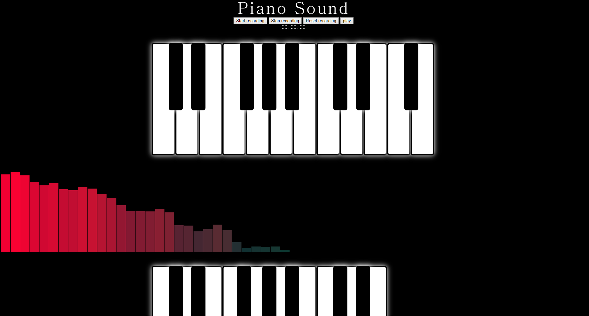

# PianoJS

Make Piano to use Javascript  
자바스크립트를 이용하여 피아노를 만들어보았습니다.

# Using bracket

If not performed with a "brackets", the sound may not be audible.  
브라켓으로 수행하지 않을 시 소리가 들리지 않을 수도 있습니다.

# Testing

  
  
can play the piano and record it.  
피아노를 칠 수 있고, 녹음이 가능하다.

# Run Video

